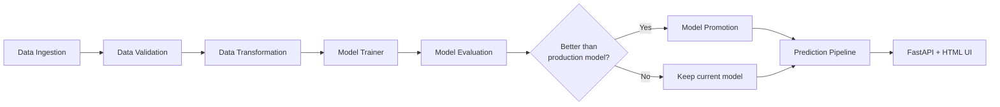

# Email Spam Classifier


An end-to-end machine learning application that classifies emails as **Spam** or **Not Spam**. It uses text preprocessing, TF-IDF vectorization, and a trained classification model, served through a **FastAPI** backend and an interactive **HTML** frontend. The project includes a modular training pipeline, **model promotion** (only better models reach production), automated **tests**, **CI with GitHub Actions**, and **Docker / Docker Compose** support.


## Features

- Real-time spam / not-spam prediction for any email text
- Modular pipeline: ingestion → validation → transformation → training → evaluation → promotion
- Schema-based data validation
- TF-IDF text vectorization with reusable, saved artifacts
- **Model promotion**: a newly trained model replaces the production model only if it performs better
- FastAPI backend with an interactive HTML frontend
- Containerized with Docker and Docker Compose
- Unit/API tests and a GitHub Actions CI workflow

---

## Tech Stack

| Area | Tools |
|------|-------|
| Language | Python 3.12 |
| ML | scikit-learn, TF-IDF, pandas, NumPy |
| API | FastAPI, Uvicorn |
| Frontend | HTML / CSS / JavaScript |
| Testing | pytest |
| CI/CD | GitHub Actions |
| Containers | Docker, Docker Compose |

---

## Architecture



---

## Project Structure

```
Email_Spam_Classifier/
├── src/emailClassifier/              # Main package
│   ├── components/
│   │   ├── data_ingestion.py         # Data loading and preprocessing
│   │   ├── data_transformation.py    # Text cleaning, vectorization, and saving
│   │   ├── data_validation.py        # Data validation logic
│   │   └── model_trainer.py          # Model training and evaluation
│   ├── pipeline/
│   │   └── prediction_pipeline.py    # Production prediction pipeline
│   └── utils/                        # Utility functions
├── artifact/                         # Trained models and data
│   ├── build_model/                  # Trained model and vectorizer
│   ├── data_ingestion/               # Ingested data
│   ├── data_transformation/          # Transformed data files
│   ├── data_validation/              # Validation status
│   └── model_evaluation/             # Model metrics
├── templates/
│   └── index.html                    # Web UI for email classification
├── config/
│   └── config.yaml                   # Configuration settings
├── research/                         # Jupyter notebooks for experimentation
│   ├── experiment.ipynb              # Experimental analysis
│   └── trials.ipynb                  # Trial runs
├── main.py                           # Main entry point for all pipelines
├── app.py                            # FastAPI application
├── setup.py                          # Package setup configuration
├── template.py                       # Template configuration and structure
├── schema.yaml                       # Data validation schema
├── params.yaml                       # Algorithm parameters
├── requirements.txt                  # Project dependencies
└── LICENSE                           # Project license
```

---

## Getting Started

### Prerequisites

- [Conda](https://docs.conda.io/) (Miniconda or Anaconda)
- Python 3.12
- Git
- (Optional) Docker and Docker Compose

### Installation

1. **Clone the repository**
   ```bash
   git clone https://github.com/<your-username>/Email_Spam_Classifier.git
   cd Email_Spam_Classifier
   ```

2. **Create the conda environment**
   ```bash
   conda create -p env python==3.12 -y
   ```

3. **Activate the environment**
   ```bash
   conda activate env/
   ```

4. **Install dependencies**
   ```bash
   pip install -r requirements.txt
   ```

---

## Running the ML Pipelines

Run all pipeline stages from the main entry point:

```bash
python main.py
```

| Stage | Component | What it does |
|-------|-----------|--------------|
| 1 | `data_ingestion.py` | Loads the dataset and saves it to `artifact/data_ingestion/` |
| 2 | `data_validation.py` | Checks the data against `schema.yaml` and writes a validation status |
| 3 | `data_transformation.py` | Cleans text, fits the TF-IDF vectorizer, saves transformed data |
| 4 | `model_trainer.py` | Trains the classifier, evaluates it, saves metrics to `artifact/model_evaluation/` |
| 5 | `model_promotion.py` | Compares the new model against the current production model and promotes it if better |

Trained models and the vectorizer are stored in `artifact/build_model/`.

---

## Model Promotion

Model promotion ensures that **a worse model never replaces a better one in production**.

**How it works**

1. The trainer produces a new *candidate* model and its evaluation metrics.
2. `model_promotion.py` loads the metrics of the current *production* model.
3. The candidate is compared to production using the chosen metric (e.g. F1-score or accuracy; configurable).
4. **If the candidate is better**, it is promoted: the model and vectorizer are copied to the production location in `artifact/build_model/`.
5. **If not**, the existing production model is kept and the candidate is not promoted.
6. If no production model exists yet (first run), the candidate is promoted automatically.

**Run only the promotion pipeline**

```bash
python -m src.emailClassifier.pipeline.model_promotion_pipeline
```

> The prediction pipeline and the API always load the **promoted** model, so promotion directly controls what users get.

---

## Running the Application

### 1. Start the backend server

```bash
uvicorn app:app --reload
```

The API is now available at `http://127.0.0.1:8000`.
Interactive Swagger docs: `http://127.0.0.1:8000/docs`.

### 2. Start the HTML frontend

In a **second terminal**:

```bash
python -m http.server 5500
```

Open `http://localhost:5500/templates/index.html` in your browser, paste an email, and click **Classify**.

> If the frontend runs on a different port than the API, make sure CORS is enabled in `app.py` and the API URL in `index.html` points to `http://127.0.0.1:8000`.

---

## API Reference

> Adjust the routes below if your `app.py` uses different names.

### `POST /predict`

Classify an email.

**Request**
```json
{
  "text": "Congratulations! You have won a free prize. Click here to claim."
}
```

**Response**
```json
{
  "prediction": "spam",
  "confidence": 98.45%
}
```

**cURL example**
```bash
curl -X POST http://127.0.0.1:8000/predict \
  -H "Content-Type: application/json" \
  -d '{"text": "You have won a free iPhone! Click now!"}'
```

---

## Docker

### Build and run with Docker

```bash
docker build -t email-spam-classifier .
docker run -p 8000:8000 email-spam-classifier
```

### Run with Docker Compose

```bash
docker compose up --build
```

Run in the background:

```bash
docker compose up -d --build
```

Stop and remove containers:

```bash
docker compose down
```

The API will be available at `http://localhost:8000`.

---

## Testing

Tests live in the `tests/` directory and run with **pytest**.

```bash
pip install pytest httpx
pytest -v
```

Run with coverage:

```bash
pip install pytest-cov
pytest --cov=src --cov-report=term-missing
```

Typical test areas:

- Text preprocessing / cleaning functions
- Data validation against `schema.yaml`
- Model promotion logic (better model is promoted, worse model is rejected)
- Prediction pipeline output
- FastAPI endpoints (using `TestClient`)

---

## CI with GitHub Actions

The workflow in `.github/workflows/ci.yml` runs automatically on every **push** and **pull request** to `main`.

**What the CI does**

1. Checks out the code
2. Sets up Python 3.12
3. Installs dependencies from `requirements.txt`
4. Runs the test suite with `pytest`
5. (Optional) Builds the Docker image to verify the container still builds

---

## Configuration

| File | Purpose |
|------|---------|
| `config/config.yaml` | Paths and artifact locations for each pipeline stage |
| `params.yaml` | Model and TF-IDF hyperparameters |
| `schema.yaml` | Expected columns and data types for validation |

Change hyperparameters in `params.yaml`, then re-run `python main.py` to retrain. The new model is promoted only if it outperforms the current one.

---

## Contributing

1. Fork the repository
2. Create a feature branch: `git checkout -b feature/your-feature`
3. Make your changes and add tests
4. Run `pytest` locally
5. Commit and push: `git push origin feature/your-feature`
6. Open a Pull Request. CI must pass before merging.

---

## License

This project is licensed under the terms of the [LICENSE](LICENSE) file.
